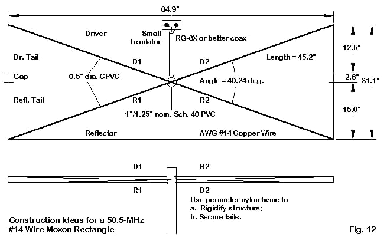

# moxon

Miscellanea, minutiae, &amp;c. related to an antenna project for the 6-meter amateur radio band

## Setting

Up until now, I've worked on the 6-meter band mostly with a quarter-λ vertical on the balcony,
and it hasn't been all bad. For example, during the midsummer peak, contacts around Europe were
possible on most days, and I was occasionally even able to get a bit farther away. Other
stations are usually horizontally polarized, though, and with a simple vertical there's zero
directivity. This leaves me deaf to even close-by stations during the less chocolate-y band
conditions.

[Moxon antenna](https://en.wikipedia.org/wiki/Moxon_antenna) was brought up on the
[#hamit.fi](https://hamit.fi/) IRC channel, and it seems like a simple enough one to construct.
Here's our reference design from [on5au.be](http://on5au.be/content/a10/moxon/6m.html):

Building this in a takedown configuration for portable operation is another must, as my
current antenna for 6 meters in the outdoors is a simple unsupported dipole, which requires
trees or other attachment points. Being able to set the stations up anywhere and aim freely
helps. I'm guesstimating that the combined surface area of the antenna and stand will be low
enough for there not to be any stability issues on "normal" (i.e., non-stormy) wind conditions.
Let's see how that goes.

## Construction

A friend has promised to donate an old camera stand for this purpose, and also a clamp to
attach a 20 mm electrical tubing mast to.
[Fiberglass tubing](https://www.ikh.fi/fi/aurauskeppi-lasikuitu-8mm-x-1520mm-era10)
will be used as the so-called spreaders. To make tuning easier and more flexible, attachment
of the antenna wire to the spreaders could be done with e.g. Finn-Savotta bungee cord and
suitable adjustments and hooks. Same stuff should work as the insulators between the radiator
and the reflector. A spare 1:1 balun I already have from the old half-wave dipole.

The only bit that is more "elaborate" is the centerpiece that joins the mast and the spreaders.
